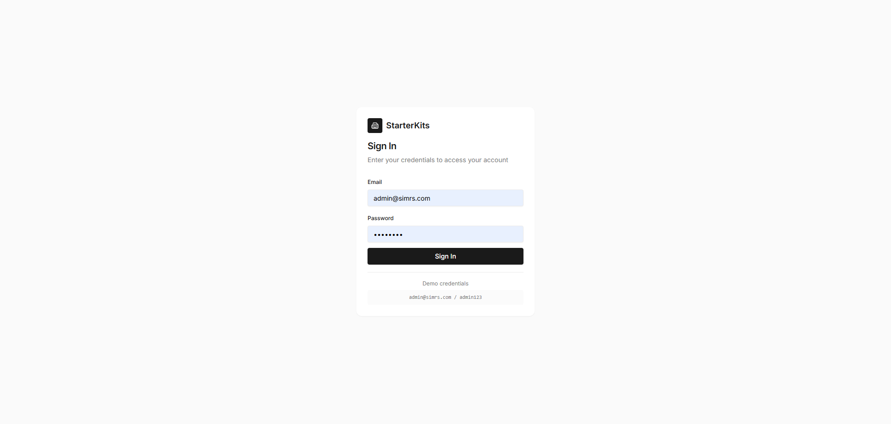
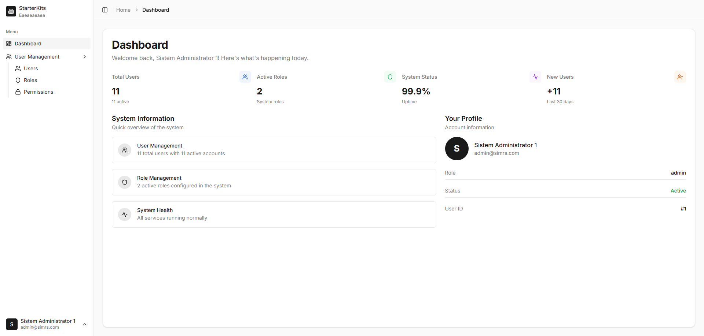
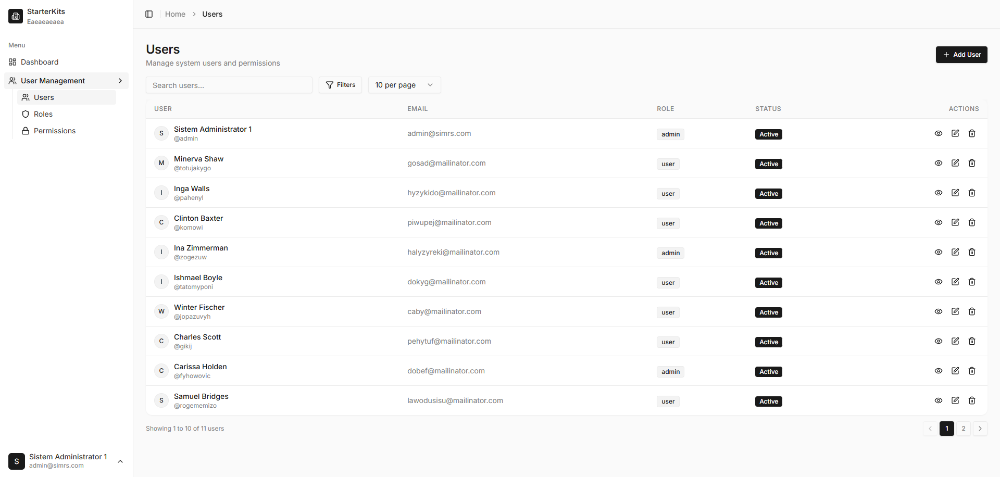
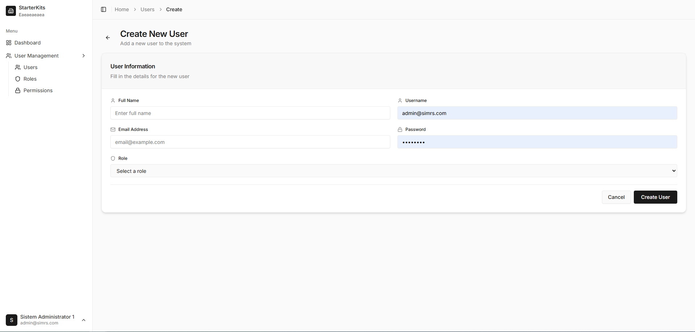
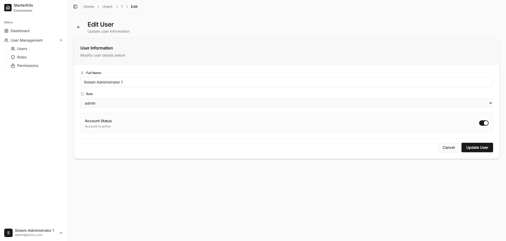
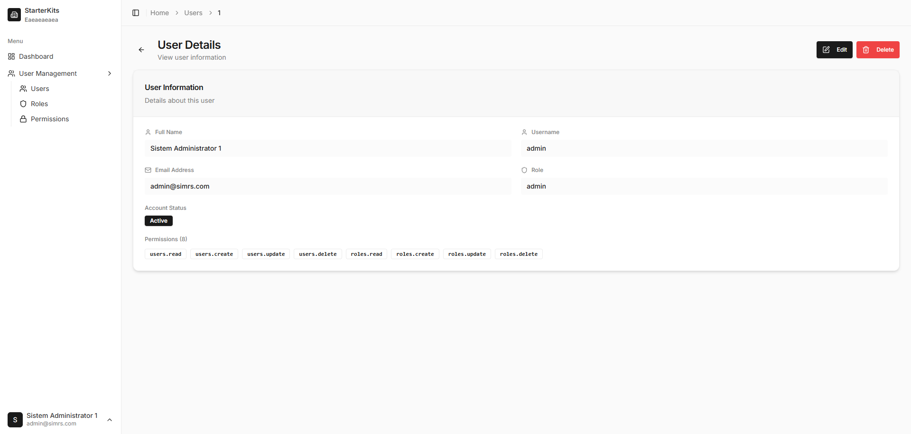
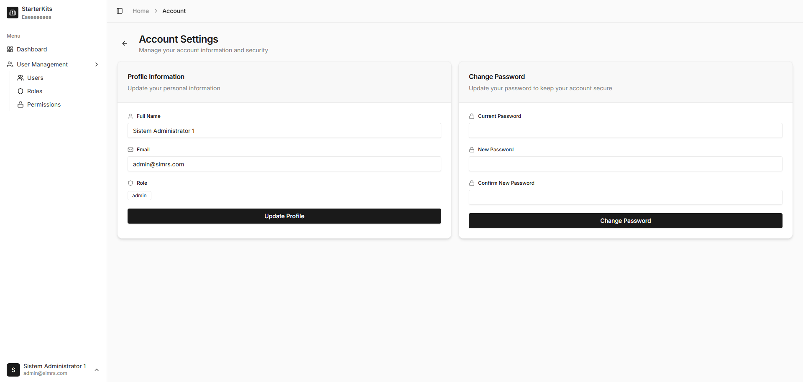
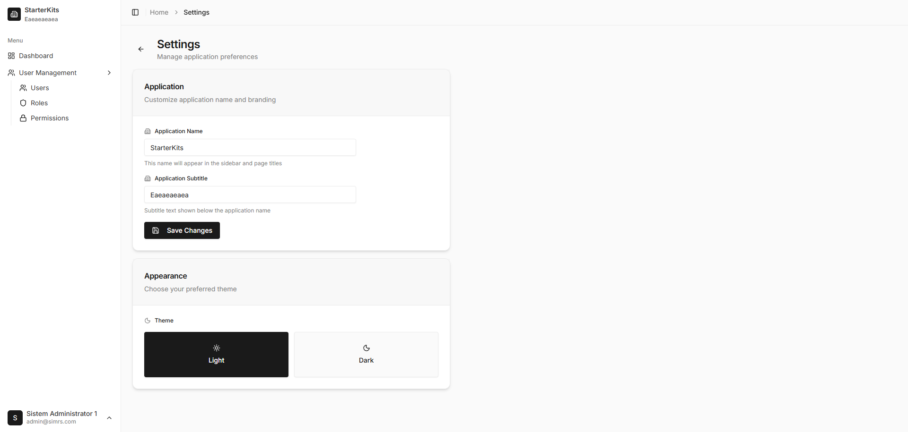

# SIMRS - Sistem Informasi Manajemen Rumah Sakit

Aplikasi fullstack untuk manajemen rumah sakit dengan **Golang (Gin + GORM)** backend dan **React TypeScript** frontend. Dilengkapi dengan autentikasi JWT dan RBAC (Role-Based Access Control).

## ✨ Features

### Backend
- ✅ **JWT Authentication** - Secure token-based authentication
- ✅ **RBAC (Role-Based Access Control)** - Granular permission system
- ✅ **Auto Migration & Seeding** - Database setup otomatis
- ✅ **RESTful API** - Clean and consistent API design
- ✅ **CORS Support** - Cross-origin resource sharing
- ✅ **Password Hashing** - Secure bcrypt encryption

### Frontend
- ✅ **Modern UI/UX** - Clean admin interface dengan shadcn/ui components
- ✅ **Dark/Light Theme** - Theme switcher dengan persistence
- ✅ **Customizable Branding** - Ubah nama aplikasi dan subtitle di settings
- ✅ **Dynamic Page Titles** - Tab browser title berubah sesuai halaman
- ✅ **Responsive Design** - Mobile-friendly layout
- ✅ **Toast Notifications** - Color-coded feedback (green success, red error)
- ✅ **Alert Dialogs** - Professional confirmation dialogs
- ✅ **Real-time Dashboard** - Live statistics dari API
- ✅ **Protected Routes** - Permission-based route guards
- ✅ **Sticky Header** - Always visible navigation
- ✅ **Collapsible Sidebar** - Space-efficient navigation

### User Management
- ✅ **User CRUD** - Create, Read, Update, Delete users
- ✅ **Profile Management** - Update profile & change password
- ✅ **Role Assignment** - Assign roles to users
- ✅ **Status Management** - Active/Inactive user status
- ✅ **Pagination** - Efficient data loading

### Role & Permission Management
- ✅ **Role CRUD** - Manage roles and their permissions
- ✅ **Permission Assignment** - Granular permission control
- ✅ **Permission Groups** - Organized by resource (users, roles, permissions)
- ✅ **Dynamic Authorization** - Real-time permission checking

## 📸 Screenshots

### Login Page


### Dashboard


### User Management - List


### User Management - Create


### User Management - Edit


### User Management - Detail


### Account Profile


### Application Settings


## 📋 Prerequisites

Pastikan sudah terinstall:
- **Go 1.20+** - [Download](https://go.dev/dl/)
- **Node.js 20.19+ & npm** - [Download](https://nodejs.org/)
- **PostgreSQL 15+** - [Download](https://www.postgresql.org/download/)

## 🛠️ Instalasi

### 1. Clone Repository

```powershell
git clone <repository-url>
cd SIMRS
```

### 2. Setup Database PostgreSQL

Buat database baru dengan menjalankan perintah SQL berikut:

```sql
CREATE DATABASE simrs;
CREATE USER simrs WITH PASSWORD 'simrs123';
GRANT ALL PRIVILEGES ON DATABASE simrs TO simrs;
```

### 3. Setup Backend

```powershell
# Masuk ke folder backend
cd backend

# Install dependencies
go mod download

# Jalankan server (auto migration & seeding akan berjalan otomatis)
go run main.go
```

**Catatan:** Database akan otomatis di-migrate dan di-seed dengan data awal saat pertama kali dijalankan.

Server backend akan berjalan di: **http://localhost:8080**

### 4. Setup Frontend

Buka terminal baru:

```powershell
# Masuk ke folder frontend
cd frontend

# Install dependencies
npm install

# Jalankan development server
npm run dev
```

Frontend akan berjalan di: **http://localhost:5173**

## 🎯 Akses Aplikasi

Setelah semua berjalan, akses aplikasi di browser:

- **Frontend:** http://localhost:5173
- **Backend API:** http://localhost:8080/api

**Default Login Credentials:**
- Email: `admin@simrs.com`
- Password: `admin123`

## 📁 Struktur Project

## 📁 Struktur Project

```
SIMRS/
├── backend/
│   ├── config/           # Konfigurasi aplikasi
│   ├── database/         # Database connection & migrations
│   ├── handlers/         # HTTP handlers (controllers)
│   ├── middleware/       # JWT & RBAC middleware
│   ├── models/           # Data models (User, Role, Permission)
│   ├── main.go           # Entry point
│   └── go.mod            # Go dependencies
│
└── frontend/
    ├── src/
    │   ├── components/
    │   │   ├── app-header.tsx       # Header dengan breadcrumb
    │   │   ├── app-sidebar.tsx      # Sidebar navigation
    │   │   ├── confirm-dialog.tsx   # Reusable alert dialog
    │   │   └── ui/                  # shadcn/ui components
    │   ├── lib/
    │   │   ├── api.ts              # API client & endpoints
    │   │   ├── store.ts            # Zustand auth state
    │   │   └── utils.ts            # Utility functions
    │   ├── pages/
    │   │   ├── auth/               # Login page
    │   │   ├── dashboard/          # Dashboard dengan stats
    │   │   ├── users/              # User management (CRUD)
    │   │   ├── roles/              # Role & permission management
    │   │   ├── permissions/        # Permission list
    │   │   ├── account/            # User profile & password
    │   │   └── settings/           # Theme settings
    │   ├── App.tsx                 # Router & routes
    │   └── main.tsx                # Entry point
    └── package.json
```

## 🔐 RBAC System

### Default Roles & Permissions

**Admin Role** - Full access
- `users.read`, `users.create`, `users.update`, `users.delete`
- `roles.read`, `roles.create`, `roles.update`, `roles.delete`
- `permissions.read`

**User Role** - Read-only access
- `users.read`
- `roles.read`
- `permissions.read`

### Permission Format
Format: `{resource}.{action}`

Contoh:
- `users.read` - Melihat daftar user
- `users.create` - Membuat user baru
- `roles.update` - Mengubah role
- `roles.delete` - Menghapus role

## 📡 API Endpoints

### Authentication
- `POST /api/auth/login` - Login (public)
- `GET /api/auth/profile` - Get current user profile (protected)

### Users
- `GET /api/users` - List users dengan pagination (requires: `users.read`)
- `GET /api/users/:id` - Get user by ID (requires: `users.read`)
- `POST /api/users` - Create new user (requires: `users.create`)
- `PUT /api/users/:id` - Update user (requires: `users.update`)
- `DELETE /api/users/:id` - Delete user (requires: `users.delete`)

### Roles
- `GET /api/roles` - List roles dengan pagination (requires: `roles.read`)
- `GET /api/roles/:id` - Get role by ID (requires: `roles.read`)
- `POST /api/roles` - Create new role (requires: `roles.create`)
- `PUT /api/roles/:id` - Update role (requires: `roles.update`)
- `DELETE /api/roles/:id` - Delete role (requires: `roles.delete`)

### Permissions
- `GET /api/permissions` - List all permissions (requires: `permissions.read`)

## 🎨 Halaman Aplikasi

1. **Login** (`/login`) - Authentication page
2. **Dashboard** (`/dashboard`) - Real-time statistics & system info
3. **Users** (`/users`) - User management dengan CRUD operations
   - Create, Edit, Show, Delete user
   - Assign roles
   - Manage status (active/inactive)
4. **Roles** (`/roles`) - Role & permission management
   - Create, Edit, Show, Delete role
   - Assign permissions
5. **Permissions** (`/permissions`) - View all available permissions
6. **Account** (`/account`) - User profile & password management
7. **Settings** (`/settings`) - Application settings
   - Customize application name & subtitle
   - Theme switcher (Dark/Light mode)

## 🎨 UI Components & Features

### Toast Notifications
- **Success** - Green background untuk operasi berhasil
- **Error** - Red background untuk error/gagal
- Auto-dismiss dengan timer
- Muncul di semua halaman (index, create, edit, show)

### Alert Dialogs
- Confirmation dialogs untuk delete operations
- Replace native browser confirm()
- Consistent styling dengan aplikasi

### Theme System
- Light mode & Dark mode
- Persistent di localStorage
- Smooth transition tanpa flash
- Support untuk semua komponen

### Application Branding
- Customizable application name (default: SIMRS)
- Customizable subtitle (default: Hospital System)
- Changes reflect immediately in sidebar
- Dynamic page titles (format: "Page Name - App Name")

### Layout
- Sticky header dengan breadcrumb navigation
- Collapsible sidebar dengan user menu
- Responsive design untuk mobile
- Consistent spacing & styling

## 🛠️ Tech Stack

**Backend:**
- [Gin](https://gin-gonic.com/) - HTTP web framework
- [GORM](https://gorm.io/) - ORM library
- [PostgreSQL Driver](https://github.com/jackc/pgx) - Database driver
- [JWT-Go](https://github.com/golang-jwt/jwt) - JWT implementation
- [bcrypt](https://pkg.go.dev/golang.org/x/crypto/bcrypt) - Password hashing

**Frontend:**
- [Vite](https://vitejs.dev/) - Build tool & dev server
- [React 18](https://react.dev/) - UI library
- [TypeScript](https://www.typescriptlang.org/) - Type safety
- [Tailwind CSS](https://tailwindcss.com/) - Utility-first CSS
- [shadcn/ui](https://ui.shadcn.com/) - UI components
- [React Router](https://reactrouter.com/) - Client-side routing
- [Zustand](https://zustand-demo.pmnd.rs/) - State management
- [Axios](https://axios-http.com/) - HTTP client
- [Lucide React](https://lucide.dev/) - Icon library

## 🚀 Production Build

### Backend
```powershell
cd backend
go build -o simrs-backend.exe
./simrs-backend.exe
```

### Frontend
```powershell
cd frontend
npm run build
```

Output ada di folder `frontend/dist` - siap untuk deploy.

## 🐛 Troubleshooting

### Backend tidak bisa connect database
- Pastikan PostgreSQL running
- Cek credentials database
- Pastikan port 5432 tidak diblokir firewall

### Frontend tidak bisa hit API
- Cek CORS settings di `backend/main.go`
- Pastikan backend berjalan di port 8080
- Cek browser console untuk error details

### JWT Token expired
- Default expiry: 24 jam
- Edit di `backend/middleware/auth.go` jika perlu

## 📄 License

MIT License

## 🤝 Contributing

Feel free to submit issues or pull requests!
